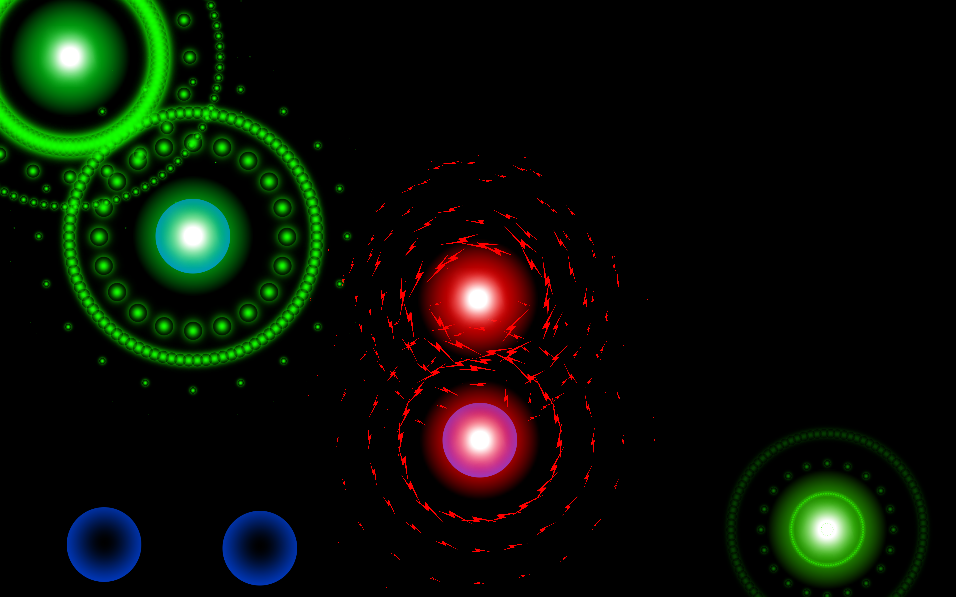

# RAD-IO - Puzzle Game

RAD-IO is an exciting puzzle game that challenges your problem-solving skills! Your objective is to transmit a green signal from one place to another using repeaters and amplifiers strategically placed in the game world. Can you master the art of signal transmission and conquer all the challenging levels?

## Key Features

- **Puzzle Solving:** Engage in mind-bending puzzles that require planning and logical thinking. Place repeaters and amplifiers strategically to navigate the green signal through obstacles and reach the destination.

- **Unity Particle System:** Experience mesmerizing visual effects with Unity's powerful particle system. Watch as particles flow and interact with the game environment, adding an immersive experience to the gameplay.

- **Multiple Levels:** Enjoy a variety of levels with increasing complexity. Each level presents unique challenges and introduces new gameplay elements, keeping you engaged and entertained.

- **Intuitive Controls:** RAD-IO offers simple and intuitive controls that make gameplay accessible to players of all skill levels. Drag and drop repeaters and amplifiers onto the grid, and watch your signal's path unfold.

## Preview

## How to Play

1. Clone or download the repository to your local machine.

2. Open the project in Unity 2017.1.0f3.

3. Explore the game scene and navigate the menu to start playing.

4. Each level presents a new puzzle with obstacles and a source/target for the green signal.

5. Drag and drop repeaters and amplifiers from the toolbox onto the grid to direct the signal's path.

6. Press the "Play" button to test your signal transmission. Adjust the repeater/amplifier positions as needed to complete the level.

7. Complete each level to unlock the next challenge!

## GitHub Pages

The project is hosted on GitHub Pages, allowing you to access a live demo of RAD-IO. Visit the [RAD-IO](https://guirosaalves.github.io/RAD-IO) to experience the gameplay firsthand.

## Contact

If you have any questions, suggestions, or feedback about RAD-IO, feel free to reach out to us:

- Email: [guilhermerosaalves@gmail.com](mailto:guilhermerosaalves@gmail.com)
- LinkedIn: [GuiRosaAlves](https://www.linkedin.com/in/guirosaalves/)

## Technologies Used

- Unity Engine (2017.1.0f3)
- Unity Particle System

## License

This project is licensed under the MIT License - see the [LICENSE](LICENSE) file for details.

## Acknowledgments

Special thanks to the Unity community for their invaluable resources and tutorials on game development and the Unity Particle System.

---

RAD-IO is an immersive puzzle game that showcases your ability to creatively use repeaters and amplifiers to transmit a green signal through obstacles. The README provides an overview of the project, its features, how to play, and the technologies used. Make sure to replace "link_to_preview.gif" with the actual link to your preview GIF or image, and update "your-username" with your actual GitHub username in the GitHub Pages link. Good luck with your project!
